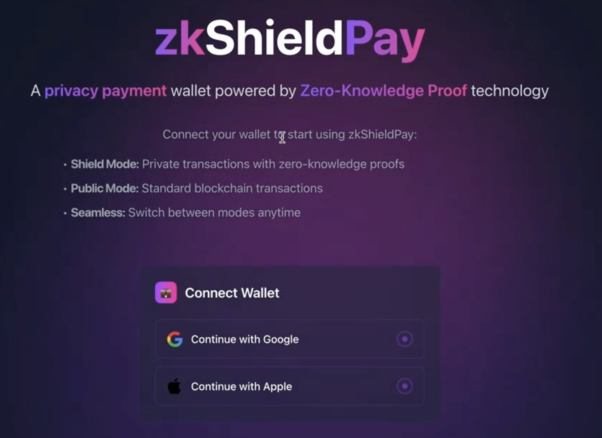
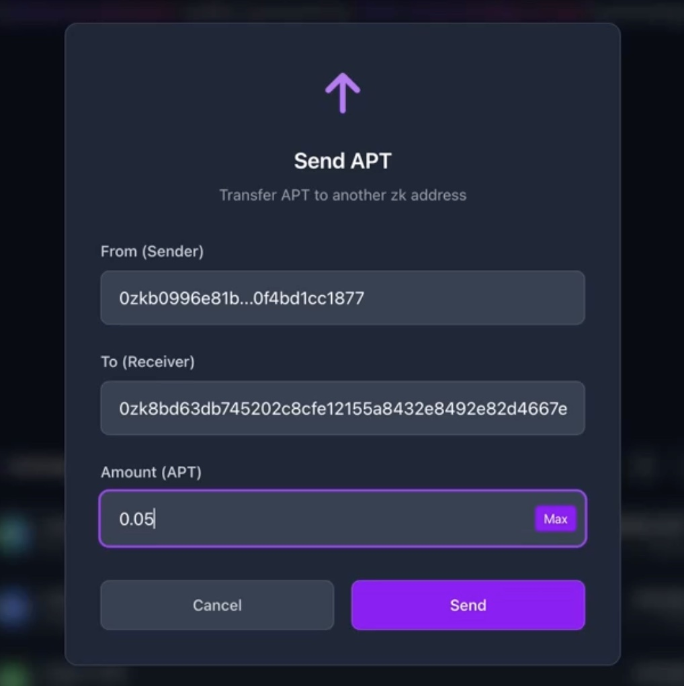

# zkShieldPay: 一种面向 Aptos 的全链路 B2B/B2C 隐私支付合规解决方案

# 项目背景与动机

链上交易的公开透明，虽然提升了可验证性，却也带来了隐私缺失的问题。在 Aptos 中，官方提供的 ACT（Confidential Transactions）机制通过加法同态隐藏交易金额，但无法实现交易双方地址以及交易路径的隐私保护。

更严重的是，我们发现存在一种针对性的协议攻击方法，可以在一定程度上滥用 Aptos Experimental Feature 的 ACT 机制用于 Money laundering （已与 Aptos Labs 团队工程师沟通确认，由于该发现有潜在风险，暂时不公开披露），这使得 ACT 机制不仅在隐私保护能力上存在不足，在某些场景下还可能带来合规隐患，这不利于合规隐私交易的愿景。

即使抛开针对性的攻击方法不谈，无论是用户进行链上支付（如B2C、B2B交易中不想泄漏交互方的场景），还是链上聪明钱 DeFi 套利、Meme 投资、策略交易等行为，交易的“参与方”与“路径”同样需要极强隐私性。现有方案无法满足上述需求。

# 项目简介

zkShieldPay 是一个面向 Aptos 生态的链上隐私支付协议，提供一个既可实现全方位隐私保护、又具备合规可验证能力的基础设施层。受到 EVM 系统隐私支付项目的启发，zkShieldPay 通过地址抽象，设计了不依赖 ACT 的另一种形式的匿名交易系统（可以在提供更强大的隐私的情况下，全链路隐私，仍然抵抗我们发现的一种新型协议攻击）核心特性包括：

- 屏蔽账户关联：为企业隐私场景 B2B 支付(商品供应链，跨境贸易等场景中的商业秘密隐私保护)或者 B2C 支付（涉及消费者个人隐私的场景如租房、酒店、出行、外卖、电商等），可以在屏蔽金额的基础上，进一步提供账户关联上的匿名性。

- 隐私条件下的合规可审计：(1)支持无罪证明 Proofs of Innocence，通过无罪证明证明用户资金流不来自于安全机构的黑名单地址，证明资金来源的安全性。(2) 支持 Tax Audit 导出。

- 可持续激励机制：zkShieldPay 可支持交易佣金与 staking 分润机制，实现协议自造血能力。

- 强可拓展性：可以基于这一框架进一步实现直接通过隐私地址与非隐私 DEX/DeFi 的交互。

# Aptos 区块链集成

详细细节请参考 `/contracts` 目录下的 [README.md](./contracts/README.md)

# 技术栈

- 前端：typescript, react, nextjs, tailwindcss
- 合约: Move
- 电路: Circom

# 安装与运行指南

```bash
# 1. FrontEnd
npm run dev
# or
yarn dev
# or
pnpm dev
# or
bun dev

# 2. Circuits
bash ./export_artifacts.sh

# 3. Contracts
aptos move build
```

# 项目亮点/创新点

1. 发现现有的试验性功能中的隐私资产和隐私交易协议存在一种针对性设计的协议攻击可以滥用现有系统。
2. 为解决这一问题，在 Aptos 的地址系统之上，抽象出新的地址系统(抽象账户)，提供 from-to-amount 的全链路隐私方案，为 B2B、B2C 拓展了更多场景（现实中的大部分场景都需要合规的隐私保护）。
3. 新的密码学协议设计，可以抵抗针对性的协议攻击，项目的合规性更好，并且支持 Proofs of Innocence 机制以及导出 Tax Audit，实现了隐私和合规两不误。

# 演示视频/截图

演示视频：（点击下方 YouTube 链接 ⬇️）

<a href="https://www.youtube.com/watch?v=Qrp1Ea-g9no" style="display: inline-block; width: 45%; text-align: left; padding-left: 10px;">
  
</a>

zkShieldPay 有两种模式，分别是标准钱包(非隐私)模式，此时正常使用标准的 Aptos 钱包地址，以及抽象账户(隐私模式)，此时使用抽象地址进行交易。

## 界面一：入口页面


## 界面二：标准钱包(非隐私模式)

此时用户可以正常使用类似标准 aptos 钱包的 send 和 receive 功能，但额外增加一个 shield 功能，可以将持有的资产隐私化，接入隐私支付系统。

.jpg)

##  界面三：资产隐私化(充值)

点击 shield 按钮，将持有的资产隐私化，从标准地址冲值到抽象地址中。

**特别说明：** 为了反洗钱和合规考虑，所有新增地址都需要一个锁定期，并在锁定期内依据 Proofs of Innocence 协议提供无罪证明（即不属于受制裁的地址的资金来源）。

.jpg)

## 界面四：抽象账户(隐私模式)

.jpg)

## 界面五：隐私转账



## 界面六：资产去匿名化(提现)

.jpg)